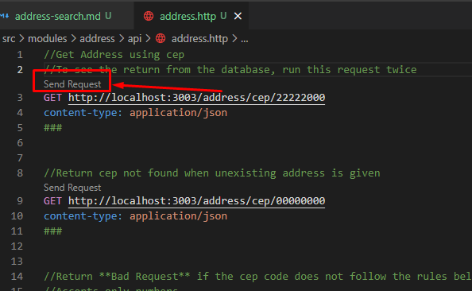

# Backend Challange - Eureka

# Description

Create an API service to receive a cep code and return an address using the viaCep API.

## Test requirements

  - Return the cep from the API and save the first search in the database
  - The second time someone searchs for it, the cep should return from the database
  - Use a frontend to input the cep and return the address
  - Create Tests for the application

 

## Infrastructure

- NodeJS backend using NestJs Framework and Typescript
- Jest as the testing framework
- Swagger
- NestJS Logger

 

### Test files:

- files `.spec.ts` - unit tests
- files `.e2e-spec.ts` - end to end tests

 

### Setup

1. clone the git repository
1. enter `/backend` folder
1. run `yarn` to install the packages (if you dont have yarn, you can use npm)
1. run `npm start` to start the aplication
1. enter `/frontend` folder
1. run `yarn` to install the packages (if you dont have yarn, you can use npm)
1. run `npm start` to start the aplication

 

## Tests

### To run the tests

1. open the terminal, access the backend folder and run the command of the chosen test type:

- to run unit tests: `npm run test:unit`
- to run end to end tests: `npm run test:e2e`
- to run all tests: `npm run test` 

 

###  Testing the API using REST Client ##

If using VSCode, inside src/modules/module-name/api, you may find `.http` files that works with the extension **REST Client**

https://marketplace.visualstudio.com/items?itemName=humao.rest-client

1. Install the extension
1. Start the aplication
1. Open the .http file
1. Click send (replace the id when necessary)

 

## Functionalities

- [Search for Address using a cep](backend/docs/address-search.md)

### Swagger

Access http://localhost:3003/docs to view swagger documentation.

 

## Architecture

I've used clean architecture with concepts of "Domain Driven Design" (which is a design tool and not an architecture). . I've separated the context by components (modules), which also follow NestJS standards. This module separation has an monolitic backend-api in mind, wich can be easily expanded. For a micro-service (with a single context), i would bring everyting inside the modules folder foward, separating the content on their corresponding layers.

The services (usecases) contains the business rules of the application.

The frontend didnt receive too much attention, since the focus is the backend and a better ui and architecture would consume too much time.
